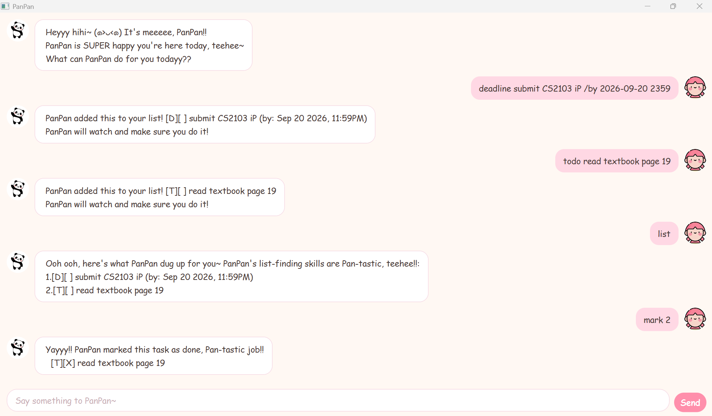

# PanPan User Guide

**PanPan** is a task-tracking chatbot with rather too much enthusiasm. It keeps your
todos, deadlines and events, remembers them between runs, and talks back in its own
voice while doing it.



You type a command, PanPan replies. That is the whole idea — there are no menus and
nothing to click except **Send**.

## Quick start

1. Make sure you have **Java 25** installed.
2. Download `pan.jar`.
3. Open a terminal in the folder holding the jar and run:

   ```
   java -jar pan.jar
   ```

4. The chat window opens with PanPan's greeting. Type a command into the box at the
   bottom and press **Enter** (or click **Send**).

Try `todo read chapter 4 of the textbook` to get started, then `list` to see it.

> **Where your tasks live.** PanPan saves to `data/pan.txt`, next to wherever you ran
> the jar from, after *every* change. There is no save command — closing the window
> never loses anything. If that file is missing on the first run, PanPan simply starts
> with an empty list.

## Command summary

| What you want | Command | Example |
|---|---|---|
| Add a todo | `todo DESCRIPTION` | `todo read chapter 4 of the textbook` |
| Add a deadline | `deadline DESCRIPTION /by DATE` | `deadline finish CS2101 reflection /by 2026-09-24 1800` |
| Add an event | `event DESCRIPTION /from DATE /to DATE` | `event CS2103 tutorial /from 2026-09-22 1400 /to 2026-09-22 1500` |
| See everything | `list` | `list` |
| Tick something off | `mark INDEX` | `mark 2` |
| Un-tick something | `unmark INDEX` | `unmark 2` |
| Search | `find KEYWORD` | `find CS2103` |
| Change one detail | `update INDEX /OPTION VALUE` | `update 2 /by 2026-09-25 2000` |
| Remove a task | `delete INDEX` | `delete 1` |
| Leave | `bye` | `bye` |

**Dates are typed as `yyyy-MM-dd HHmm`** — four-digit year, two-digit month and day,
then a 24-hour time with no colon. `2026-09-24 1800` means 24 September 2026 at 6pm.
PanPan shows them back in a friendlier form, `Sep 24 2026, 6:00PM`.

**`INDEX` is the number shown by `list`**, counting from 1.

**Command words are not case-sensitive** — `todo`, `Todo` and `TODO` all work.

---

## Adding a todo

A task with nothing but a description.

Format: `todo DESCRIPTION`

Example: `todo read chapter 4 of the textbook`

```
 PanPan added this to your list! [T][ ] read chapter 4 of the textbook
 PanPan will watch and make sure you do it!
```

The `[T]` marks it as a todo. The empty `[ ]` means it is not done yet.

## Adding a deadline

A task that must be finished by a particular moment.

Format: `deadline DESCRIPTION /by yyyy-MM-dd HHmm`

Example: `deadline finish CS2101 reflection /by 2026-09-24 1800`

```
 PanPan added this to your list! [D][ ] finish CS2101 reflection (by: Sep 24 2026, 6:00PM)
 PanPan will watch and make sure you do it!
```

## Adding an event

A task that runs from one moment to another.

Format: `event DESCRIPTION /from yyyy-MM-dd HHmm /to yyyy-MM-dd HHmm`

Example: `event CS2103 tutorial /from 2026-09-22 1400 /to 2026-09-22 1500`

```
 PanPan added this to your list! [E][ ] CS2103 tutorial (from: Sep 22 2026, 2:00PM to: Sep 22 2026, 3:00PM)
 PanPan will watch and make sure you do it!
```

PanPan will not accept an event that finishes before it starts. Both halves are
required — `/from` on its own is not enough.

## Listing everything

Format: `list`

```
 Ooh ooh, here's what PanPan dug up for you~ PanPan's list-finding skills are Pan-tastic, teehee!!:
 1.[T][ ] read chapter 4 of the textbook
 2.[D][ ] finish CS2101 reflection (by: Sep 24 2026, 6:00PM)
 3.[E][ ] CS2103 tutorial (from: Sep 22 2026, 2:00PM to: Sep 22 2026, 3:00PM)
```

The numbers here are the `INDEX` every other command wants. They shift when you delete
something, so run `list` again if you are unsure.

## Marking a task done, and undoing it

Format: `mark INDEX` and `unmark INDEX`

Example: `mark 2`

```
 Yayyy!! PanPan marked this task as done, Pan-tastic job!!
   [D][X] finish CS2101 reflection (by: Sep 24 2026, 6:00PM)
```

Example: `unmark 2`

```
 Awww not done yet? PanPan unmarked this task already... PanPan thinks you can do better!
   [D][ ] finish CS2101 reflection (by: Sep 24 2026, 6:00PM)
```

The `[X]` is the tick.

## Finding tasks

Shows every task whose description contains the keyword.

Format: `find KEYWORD`

Example: `find CS2103`

```
 Oooh, PanPan found these ones hiding in your list~ (⁎˃ᴗ˂⁎)
 1.[E][ ] CS2103 tutorial (from: Sep 22 2026, 2:00PM to: Sep 22 2026, 3:00PM)
```

Two things to know. The search **is** case-sensitive, so `find book` will not find
`Book`. And the numbers in the results are positions *within the results*, not the
task's real index — go back to `list` before marking or deleting anything.

## Updating a task

Changes one detail of a task and leaves everything else exactly as it was, including
whether it is done and where it sits in the list. This is the alternative to deleting
a task and retyping it.

Format: `update INDEX /OPTION NEW_VALUE`

| Option | Changes | Works on |
|---|---|---|
| `/desc` | the description | any task |
| `/by` | the due date | a deadline |
| `/from` | the start | an event |
| `/to` | the end | an event |

Example: `update 2 /by 2026-09-25 2000`

```
 Ooooh, PanPan changed just that bit! Everything else stays the same~ (◕ᴗ◕✿)
   [D][ ] finish CS2101 reflection (by: Sep 25 2026, 8:00PM)
```

Example: `update 1 /desc read chapter 5 of the textbook`

```
 Ooooh, PanPan changed just that bit! Everything else stays the same~ (◕ᴗ◕✿)
   [T][ ] read chapter 5 of the textbook
```

**One option per command.** `update 2 /desc lunch /by 2026-09-25 2000` is refused
rather than quietly folding the second half into the description — run two `update`
commands instead. Asking for an option a task does not have, such as `/by` on a todo,
is also refused.

## Deleting a task

Format: `delete INDEX`

Example: `delete 1`

```
 Okayyy, PanPan waved byebye to this task and removed it from the list~ (｡•̀ᴗ-)✧
   [T][ ] read chapter 5 of the textbook
 PanPan is now keeping 2 tasks safe for you!
```

Deleting renumbers everything after it, so check `list` before deleting again.

## Leaving

Format: `bye`

```
 Byeee Byeee! PanPan will stay cute for you in the meantime! Mwah mwah~ (˘▾˘~)
```

The window closes a moment later. Everything is already saved.

---

## When something goes wrong

PanPan never crashes at you — a mistake gets a reply, and the list is left alone.

| If you… | PanPan says something like |
|---|---|
| type a command it does not know | ` SORRYYY! PanPan don't know what that means.` |
| give a task number that does not exist | ` Ehh?? PanPan looked everywhere but that task number isn't there~` |
| give something that is not a number | ` Ooh wait wait~ PanPan needs a real task number, like "mark 2", okay??` |
| write a date it cannot read | ` Urmm, PanPan don't know how to read that date~ write it like: 2019-10-15 1800  (yyyy-MM-dd HHmm)!` |
| leave out a description or a date | a reminder of what is missing, naming the part |

If the save file has been edited by hand and some lines no longer make sense, PanPan
loads everything it *can* read, keeps going, and tells you how many lines it skipped.

## Running from the source instead

If you have the repository rather than the jar:

```
./gradlew run          # the chat window
./gradlew shadowJar    # builds build/libs/pan.jar
```

There is also a plain console version, if you would rather stay in the terminal —
run `pan.Pan` instead of `pan.Launcher`. It takes exactly the same commands.

## Acknowledgements

- The project skeleton, the Gradle setup and `CONTRIBUTORS.md` come from the
  [se-education.org](https://se-education.org/) `ip` template.
- The JavaFX front end — `Launcher`, `Main`, `MainWindow`, `DialogBox` and the
  `fx:root` pattern in the FXML files — follows the se-education
  [JavaFX tutorial](https://se-education.org/guides/tutorials/javaFx.html),
  Parts 1 to 4.
- The avatar images in `src/main/resources/images/` were sourced from the web;
  the original creator is not known.
- The Java coding conventions and the Git commit-message conventions followed
  here are the [se-education guides](https://se-education.org/guides/).
- Some code in this project was written with the assistance of Claude
  (Anthropic), reviewed and accepted by me.